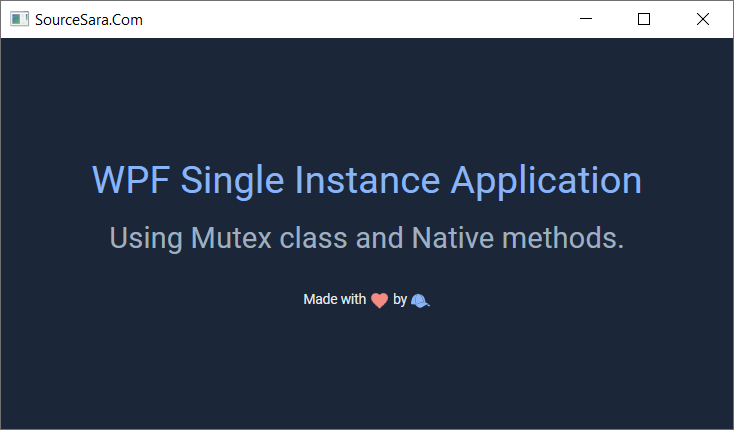

# WPF Single Instance Application
<h4 dir="rtl" align="right">
برای مشاهده آموزش به لینک زیر مراجعه کنید.
</h4>

  <a href="https://sourcesara.com/wpf-single-instance-application/">آموزش ساخت برنامه تک نمونه ای (Single Instance App) در WPF</a>

  

